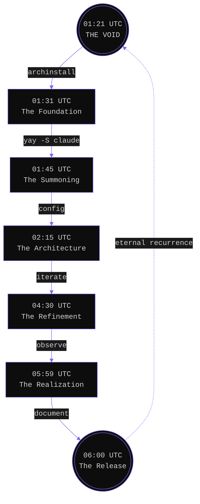

# Start From Scratch. Use Arch. Let AI Do The Heavy Lifting.

*A manifesto for the impatient developer who refuses to compromise*

---

## The Bureaucracy of Advice

"Use Ubuntu," they chant. "Don't waste time."
A chorus of the well-meaning, handing you forms to fill out for a life you don't live.
That advice belongs to a world that no longer exists.

I booted a fresh Arch install at 01:21 UTC. By 06:00 UTC, I had a fully configured Hyprland desktop.
**4 hours and 38 minutes.** From the void to a system that is *mine*.

---

## Evidence of Existence

Not hypothetical productivity. Concrete artifacts:

- **Hyprland**: Configured from scratch.
- **Vim-style Everything**: HJKL navigation. The mouse is an artifact.
- **OCR Screenshots**: `Super+Shift+6` extracts text.
- **Clipboard History**: Searchable.
- **Neovim**: LSP, Telescope. Not VS Code.
- **Claude Code**: The invisible collaborator.

---

## The Absurdity of Effort

Why suffer through wiki pages written by ghosts?
The old advice—struggle equals character—is dead.

I described the destination. Claude built the bridge.
"Add vim bindings." Done.
"Configure auto-lock." Done.

I didn't memorize syntax. I refused the hazing ritual that Linux culture mistakes for education.

---

## The Necessary Void

Ubuntu is crowded with others' decisions. Canonical's opinions.
Arch is empty.

In that emptiness, you are free.
You combine the clean slate with an AI that implements your will.
**Custom and fast.** The paradox is resolved.

---

## The Timeline



I understand my config because I read the code it wrote. I didn't suffer for it.
Stop inheriting technical debt from dotfiles. Start from zero.

---

## The Document

Claude read my logs, wrote this manifesto, created the repo, and pushed it.
I didn't touch git.
We ship while others argue.

*Built on Arch. Configured with Claude. Written at 6:00 AM UTC.*

---

### The Receipt

**Desktop:** Hyprland, Waybar, Wofi, Dunst, Hyprlock, Hypridle
**Clipboard:** wl-clipboard, cliphist, grim, slurp, tesseract
**Dev:** Neovim, Claude Code CLI, GitHub CLI, Rust, jq
**Terminal:** Alacritty, blesh-git, z
**Fonts:** 60+ Nerd Font variants
**Disk:** gdu, disktui, diskonaut

---

<div align="center">

<br>

```
▒▒▒▒▒▒▒▒▒▒▒▒▒▒▒▒▒▒▒▒▒▒▒▒▒▒▒▒▒▒▒▒▒▒▒▒▒▒▒▒▒▒▒▒▒▒▒▒▒▒▒▒▒▒▒▒▒▒▒▒
▒                                                          ▒
▒    WHO                                                   ▒
▒        THE                                               ▒
▒            FUCK                                          ▒
▒                 AM I                                     ▒
▒                                                          ▒
▒▒▒▒▒▒▒▒▒▒▒▒▒▒▒▒▒▒▒▒▒▒▒▒▒▒▒▒▒▒▒▒▒▒▒▒▒▒▒▒▒▒▒▒▒▒▒▒▒▒▒▒▒▒▒▒▒▒▒▒
```

<br>

**PURPLE EVERYTHING**

<br>

```
@yanbussieres
```

<sub>TESTING · ARCH · 2026</sub>

</div>